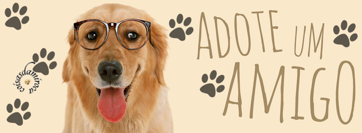
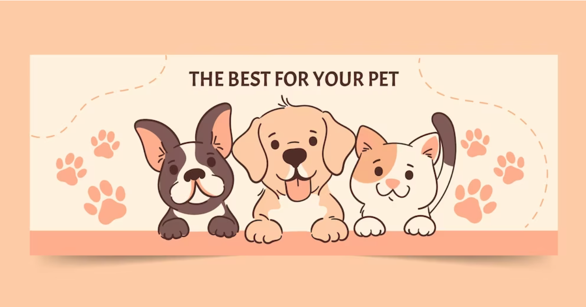

# Projeto Integrador Front-End   Portal Tech - Proz Educação 

  

## Curso de Introdução à Programação Web   Turma 11 - Grupo 5 - Professor: Rand
### Repositório com os arquivos criados durante o projeto Integrador

---

## **Tecnologias Utilizadas:**

  
  &nbsp;&nbsp;
  
  &nbsp;&nbsp;
  
  &nbsp;&nbsp;
  
  &nbsp;&nbsp;
  
  &nbsp;&nbsp;
  
  &nbsp;&nbsp;
  
  &nbsp;&nbsp;
  
  &nbsp;&nbsp;

---

## **Nome do Site:** 🐶 Kanino 🐱

---

# Briefing

## Objetivo
O objetivo da Pet Shop Kanino é incentivar a doação de alimentos e/ou objetos não utilizados, assim como doação de animais, adoção responsável de animais abandonados e/ou resgatados de maus tratos. Além de conscientizar o maximo possivel as pessoas sobre o combate aos maus tratos des animais.
Esse projeto faz a ponte entre clinicas veterianrias e cidadões comuns, almém de promover a adoção e divulgação de produtos de Pet Shop e campanhas de adoção.

### 6 Telas
* Loja/Categorias/Promoções (Ariel) Tela designada para venda de produtos que seram vendidos no petshop.

* Doações (Jamile) Tela desiginada para realização de doação (Dinheiro, objetos, animais)

* Chamado (Wesley) Tela designada para abertura de chamado para receber ajuda, referente a castração, ajuda com ração e etc.

* Blog (Sergio) Tela designada para esclarecimento de duvidas de tutores.

* FAQ (Jennifer) Tela designada para esclarecimento de duvidas gerais.

* Entrar/Cadastras (Douglas) Tela de cadastro, login de pessoas fisicas e veterinarios parceiros

### Necessidades do visitante (Público Alvo):
* Pais de Pets que querem adotar cachorro ou gato
* Comprar produtos para estes pets

### Link do SITE (projeto em construção)

Você pode conferir como o site está ficando em [Site da KANINO](https://github.com/ArielVe/KANINO_PROZ/tree/main/loja)

## :handshake: **EQUIPE: Go Devs**

  

| Perfil | Nome | Função | Github | Linkedin |
| ---------------- | ----- | --------- | --------- | --------- |
|  | `Ariel Dantas` | Scrum Master   Front-End |  |  |
|  | `Jamile Santos` | Front-End |  |  |
|  | `Jennifer` | Front-End  |  |  |
|  | `Douglas Quintanilha` | Front-End |  |  |
|  | `Sérgio Pereira` | Front-End    |  |  |
|  | `Wesley` | Front-End |  |  |

## Agradecimentos

* Proz Tecnologia;
* Portal Tech;
* AWS;
* Meta;
* Professor [Rand](https://github.com/RandMelville);
* Aos membros do projeto pela dedicação;

