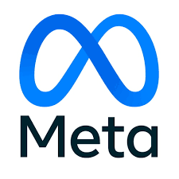

# Projeto Integrador   Curso de Introdução à Programação com foco em Front-End   Proz Educação - Portal Tech

### Turma: 11 - Grupo: A - Professor: Randerson Melville.

**O Portal Tech é um programa criado pela AWS e pela Meta para abrir um portal de acesso ao conhecimento sobre algumas das tecnologias que mais crescem no mundo: computação em nuvem, metaverso e marketing digital.** 

  
  
  
  

### Este repositório contém arquivos criados com a finalidade de cumprimento do Projeto de Conclusão de Curso.

---

## **Tecnologias Utilizadas:**

  
  &nbsp;&nbsp;
  
  &nbsp;&nbsp;
  
  &nbsp;&nbsp;
  
  &nbsp;&nbsp;
  
  &nbsp;&nbsp;
  
  &nbsp;&nbsp;
  
  &nbsp;&nbsp;
  &nbsp;&nbsp;

---

## **Nome do Site:** 🐶 Kanino 🐱

  

---

# Informações:

## Objetivo
O objetivo da Kanino é incentivar a doação de alimentos e/ou objetos não utilizados, assim como doação de animais, adoção responsável de animais abandonados e/ou resgatados de maus tratos. Além de conscientizar o maximo possivel as pessoas sobre o combate aos maus tratos des animais.
Esse projeto faz a ponte entre clinicas veterianrias e cidadões comuns, além de promover a adoção e divulgação de produtos de Pet Shop.

### 6 Telas
* Home: Depoimentos de usuários, Sobre Nós, Missão e Valores.

* Login: Acesso de usuários, veterinários e ONG's ao site; além de possibilidade de recuperação de senha. 

* Cadastro: Cadastro de usuários, veterinários e ONG's.

* Dúvidas: Envio de possíveis dúvidas pelo usuário para serem respondidas por veterinários ou ONG's. 

* Resultados: Resultado de buscas dentro do site sobre veterinários e ONG's.

* Depoimentos: Escrita de depoimentos sobre o site, veterinários ou ONG's. 

### Necessidades do visitante (Público Alvo):
* Pais de Pets que querem adotar cachorro ou gato.
* Pessoas que desejem contribuir com as ONG's parceiras.
* Veterinários que desejam realizar consultas voluntárias.
* ONG's que desejam receber doações. 

### Link do SITE (projeto em construção)

Você pode conferir como o site está ficando em [Site da KANINO](https://github.com/ArielVe/KANINO_PROZ/)

## Equipe de desenvolvedores: 

| Perfil | Nome | Função | Github | Linkedin |
| :----------------: | :-----: | :---------: | :---------: | :---------: |
|  | `Ariel Dantas` | Scrum Master   Front-End |  |  |
|  | `Jamile Santos` | Front-End |  |  |
|  | `Douglas Quintanilha` | Front-End |  |  |
|  | `Matheus Monteiro` | Front-End |  |  |
|  | `Sérgio Pereira` | Front-End    |  | </a> |
|  | `Wesley Alvarenga` | Front-End |  | </a> |

### Agradecimentos:
* [Proz - Educação](https://prozeducacao.com.br/);

* [Portal Tech](https://www.portaltechs.com/);
  
* [AWS](https://aws.amazon.com/pt/?nc2=h_lg);

* [META](https://about.meta.com/br/);

* [Professor Rand](https://github.com/RandMelville);
  
* Aos membros do projeto pela dedicação;

